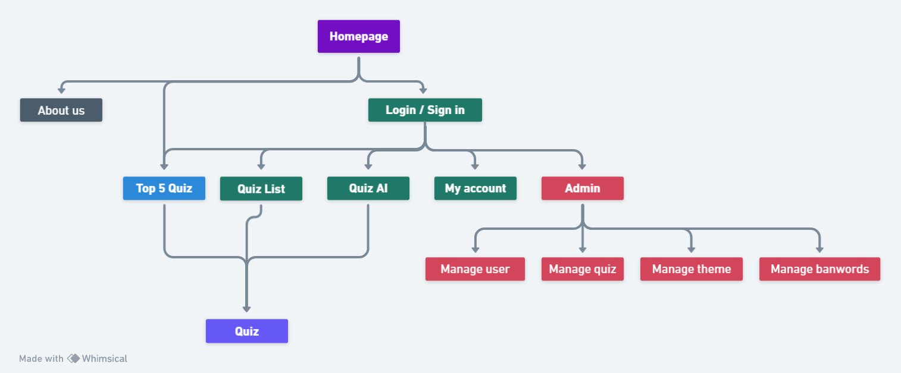

# Project: The Infinity Quiz

## Project Initialization

- Run `npm i` in the front folder
- Run `npm i` in the back folder
- Set up the `.env` file
- Run `npm run initDB` in the back folder
- Run `npm run dev` in both the front and back folders
- Enjoy !

## Requirements Definition

### Overview

"The Infinity Quiz" is a project aimed at creating a quiz website where the theme is defined by the user and then generated by AI using the OpenAI API. The quizzes thus generated are then saved and made available to all users on a dedicated page.

A quiz will have a theme, a difficulty, and will initially consist of 10 questions and 4 associated answers. The 10 questions will be displayed one by one, and a result will be shown at the end summarizing all the questions and indicating the correct answers to each.

---

### Needs Definition

Our initial thought was oriented towards education because after our daily classes, we wanted to engage in a fun yet informative way about the topics studied. What better way than a good quiz to practice?

The issue is that writing quizzes is quite time-consuming and energy-intensive. This is where AI comes in, making the development of questions and answers quick and interesting.

Beyond that, the quiz can also be used for entertainment, as the choice of topic is specific to the user. A user wishing to generate something serious will request a serious theme, whereas a topic more oriented towards entertainment, such as "carrots," for example, will also be considered.

We aim to meet the demand for personalized quizzes by generating them through artificial intelligence, automating the process, and applying the necessary restrictions to obtain reliable results in line with the user's initial request.

---

### Functional Specifications

**MVP (Minimum Viable Product):**

- A quiz of 10 questions / 4 answers per question accessible to all visitors
- Display of results and errors made or correct answers
- Account management to register / log in a user
- Account management page for users to manage their data and public profile (profile picture / password / pseudo modification)
- Administrator interface to manage quizzes / users / banwords / stats
- Display and referencing page of all saved quizzes
- Display (on the quiz referencing page) of results if the quiz has already been taken
- Implementation of quiz generation with AI
- Implementation of a waiting animation during quiz loading and generation
- Ability to save the quiz if the user finds it relevant
- Implementation of a voting system (positive or negative) on a completed quiz to highlight the most popular quizzes

**Additional Features:**

- Implementation of a random quiz launch system
- Handling forgotten passwords / double opt-in
- OAuth - Implementation of authentication with a Google account
- Implementation of a payment system (subscription) to unlock a larger number of prompts for a subscribed account in order to offset the costs associated with the OpenAI API
- Implementation of subscriber account management
- Implementation of an experience / level system based on the number of quizzes completed
- Implementation of rewards system linked to the user account's experience
- Implementation of a system to resume quizzes in progress and not finished
- Implementation of a language selection system

---

### Technical Specifications

    - Frontend:

    - React (library) - For dynamic interface
    - SASS
    - React-toastify
    - React-loader-spinner
    - React-type-animation
    - vite

    - Backend:

    - Node.js (JS server-side framework)
    - Express (Node.js framework)
    - PostgreSQL
    - Neon-tech
    - JSON Web Token - Authentication
    - express-rate-limit - Rate limiter for API calls
    - OpenAI API - Quiz generation via AI
    - uuidV4
    - Node-cache
    - Joi - Data validation
    - Winston - Logger

    - Versioning:

    - Github

---

### Project Target Audience

Anyone wishing to have fun, delve into a subject, or simply inquire about a personalized or pre-generated topic by someone else. Initially targeting French speakers, but expected to expand. Works on computers, phones, or tablets.

### Browser Compatibility

    - Mozilla Firefox
    - Safari
    - Google Chrome

---

### Application Structure

A regular visitor can access the homepage, where there are links to login/create an account and access the "quiz" page featuring the site's top 5 quizzes. They can click on a quiz to take it.

A logged-in user can also access the page listing all quizzes. They also have access to their account management page to modify their pseudonym, password, or profile picture. They can access the quiz generation page, where they can enter a theme they're interested in. When they click "generate the quiz," they must wait for the quiz to be proposed to them (generation and verification delay of OpenAI's response). Once the quiz is generated, they can take it, and upon completion, they have a page summarizing their questions/answers. If they like the quiz, they can choose to save it. If they save it, the quiz is made available on the page listing all existing quizzes. Otherwise, the quiz is deleted. If they take quizzes already generated, they can give a positive or negative vote on them the first time they take the quiz.

On the quiz referencing page, there is the possibility to sort by quizzes already taken, not taken, or to perform an exact search by theme.

Regarding the admin page, it will be possible to manage users to delete their account, manage quizzes to modify / delete them, and manage "banwords" which allow for initial validation when writing the theme by the user.

---

### User Stories

| As a          | I want to                                         | So that                                   |
| ------------- | ------------------------------------------------- | ----------------------------------------- |
| visitor       | access the top 5 quizzes                          | to choose a quiz                          |
| visitor       | access an existing top quiz                       | to take the quiz                          |
| visitor       | access the signup page                             | to create an account                      |
| visitor       | access the signin page                             | to log in to my account                   |
| visitor       | access the About page                               | to view static About page                 |
| --            | --                                                  | --                                        |
| user          | access the list of quizzes                         | to choose a quiz                          |
| user          | access an existing quiz                             | to take the quiz                          |
| user          | obtain a score after taking a quiz                 | to know my score for later                |
| user          | rate the quiz after taking it                      | to improve the rating of a quiz           |
| user          | access the account management page                 | to modify my profile picture              |
| user          | access the account management page                 | to modify my pseudonym                    |
| user          | access the account management page                 | to modify my password                     |
| user          | access the account management page                 | to delete my account                      |
| user          | access quizzes generated by AI (limited in number)  | to generate a personalized quiz           |
| user          | save the generated quiz                             | to make the quiz public and save it       |
| user          | log out                                            | to log out                                |
| --            | --                                                  | --                                        |
| administrator | access the list of users                           | to control / ban                          |
| administrator | access the list of quizzes                         | to modify / delete                        |
| administrator | access the list of banwords                        | to add / delete                           |
| administrator | access the statistics list                               | to monitor the data                      |

---

### Roles of Each Team Member

    - Guillaume Comparet: Product Owner / Technical references: git
    - Florian Lefebvre: Lead back-end developer / Scrum Master
